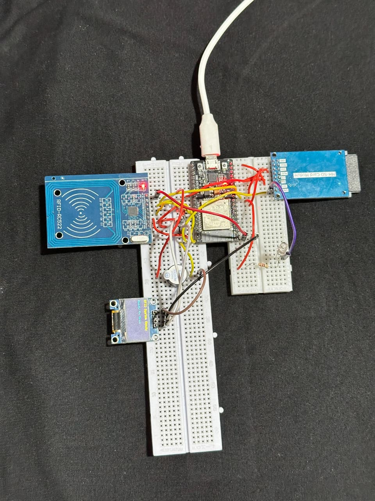

# IoT-Based Smart RFID User Management and Access Control System Using ESP32

> A smart IoT-based RFID authentication and access control system built using ESP32, RC522 RFID module, OLED display, SD card logging, LED indicators, buzzer alerts, and a web dashboard for real-time user management and monitoring.

---

## 📌 Features

- 🔐 RFID-based authentication system
- 🌐 Web dashboard using ESP32 Async Web Server
- 💾 SD card logging and persistent storage
- 📟 OLED display for real-time status updates
- 🔔 Buzzer alert system
- 💡 LED indication system
- 📡 WiFi-enabled monitoring
- 🧾 User role management
- 🕒 Real-time date and time display
- 📂 LittleFS filesystem integration
- ⚡ Dual SPI architecture (VSPI + HSPI)

---

## 🛠 Hardware Used

| Component | Description |
|---|---|
| ESP32-WROOM-32D | Main microcontroller |
| RC522 RFID Module | RFID reader |
| SSD1306 OLED | OLED display |
| SD Card Module | Data logging |
| Active Buzzer | Audio alerts |
| LED + 220Ω Resistor | Visual indication |
| RFID Tags/Cards | Authentication |

---

## 🔌 Final Connections

### 📟 RC522 RFID Module (VSPI)

| RC522 Pin | ESP32 Pin |
|---|---|
| SDA / SS | GPIO 5 |
| SCK | GPIO 18 |
| MOSI | GPIO 23 |
| MISO | GPIO 19 |
| RST | GPIO 27 |
| 3.3V | 3.3V |
| GND | GND |

---

### 💾 SD Card Module (HSPI)

| SD Pin | ESP32 Pin |
|---|---|
| CS | GPIO 16 |
| SCK | GPIO 14 |
| MOSI | GPIO 13 |
| MISO | GPIO 25 |
| VCC | 5V |
| GND | GND |

---

### 💡 LED

| LED Part | ESP32 Pin |
|---|---|
| Long Leg (+) | GPIO 26 through 220Ω resistor |
| Short Leg (-) | GND |

---

### 🔔 Active Buzzer

| Buzzer Pin | ESP32 Pin |
|---|---|
| Long Leg (+) | GPIO 4 |
| Short Leg (-) | GND |

---

### 📟 OLED Display (I2C)

| OLED Pin | ESP32 Pin |
|---|---|
| VCC | 3.3V |
| GND | GND |
| SDA | GPIO 21 |
| SCL | GPIO 22 |

---
# 🚀 How To Run The Project

---

## Step 1 — Install Arduino IDE

Download and install:

🔗 https://www.arduino.cc/en/software

---

## Step 2 — Install ESP32 Board Package

Open Arduino IDE:

```
File → Preferences
```

Add this URL in the **Additional Boards Manager URLs** field:

```
https://raw.githubusercontent.com/espressif/arduino-esp32/gh-pages/package_esp32_index.json
```

Then navigate to:

```
Tools → Board → Boards Manager
```

Search for:

```
ESP32
```

Install:

```
ESP32 by Espressif Systems (Version 2.0.17)
```

---

## Step 3 — Install Required Libraries

Go to:

```
Sketch → Include Library → Manage Libraries
```

Install all required libraries listed in the README.

---

## Step 4 — Install LittleFS Plugin

Download the plugin:

🔗 https://github.com/lorol/arduino-esp32littlefs-plugin/releases

Extract it inside:

```
Documents/Arduino/tools/
```

Restart Arduino IDE.

---

## Step 5 — Open Project

Open the main sketch file:

```
ESP32_RFID_User_Management_WS.ino
```

---

## Step 6 — Configure WiFi

Inside the code, replace the placeholder credentials:

```cpp
const char* ssid     = "YOUR_WIFI_NAME";
const char* password = "YOUR_WIFI_PASSWORD";
```

with your actual WiFi credentials.

---

## Step 7 — Select Board & Port

Select the board in Arduino IDE:

```
Tools → Board → ESP32 Dev Module
```

Select your COM port:

```
Tools → Port → (your COM port)
```

---

## Step 8 — Upload The Code

Click the **Upload** button.

> ⚠️ **If upload fails:** Disconnect the SD card module temporarily and try uploading again.

---

## Step 9 — Upload LittleFS Files

Inside the project folder, create a directory:

```
data/
```

Place all web files (HTML, CSS, JS) inside it.

Then upload via:

```
Tools → ESP32 LittleFS Data Upload
```

---

## Step 10 — Open Serial Monitor

Set baud rate to:

```
115200
```

You should see output like:

```
WiFi Connected
ESP IP Address: xxx.xxx.xxx.xxx
```

---

## Step 11 — Open Web Dashboard

Open your browser and visit:

```
http://ESP32_IP_ADDRESS
```

Example:

```
http://192.168.1.100
```

---

## Step 12 — Scan RFID Card

When an RFID card is scanned, the system will:

- 📟 OLED updates with user status
- 💡 LED blinks
- 🔔 Buzzer beeps
- 💾 Log saved to SD card
- 🌐 Web dashboard updates in real time
---
## Final Working System

---
## 📷 OLED Features

- Access Granted / Denied screen
- RFID UID display
- User role display
- Real-time date & time
- System ready screen

---

## 🌐 Web Dashboard Features

- User management
- Full access logs
- RFID monitoring
- Add/remove users
- Live authentication status

---

## 📚 Libraries Used

- MFRC522
- ESPAsyncWebServer
- AsyncTCP
- Adafruit SSD1306
- Adafruit GFX
- SD
- SPI
- WiFi
- LittleFS

---

## ⚙️ Technical Challenges Solved

- SPI bus conflict resolution
- Dual SPI implementation using VSPI and HSPI
- LittleFS web filesystem integration
- ESP32 boot pin debugging
- SD card communication stabilization
- OLED and RFID synchronization

---

## 🚀 Future Enhancements

- Servo-based smart door lock
- Firebase cloud integration
- Telegram notifications
- Mobile application
- Fingerprint authentication
- Face recognition
- Blockchain-based tamper-proof logs

---

## 📸 Project Demo

### RFID Authentication Flow

```text
RFID Card
   ↓
ESP32 Reads UID
   ↓
OLED Displays Status
   ↓
LED & Buzzer Activate
   ↓
Data Logged To SD Card
   ↓
Web Dashboard Updates
```

---

## 👨‍💻 Author

**Muhammad Azfar Waqas**  
BS Cybersecurity — University of Wah

---

## ⭐ If You Like This Project

Give this repository a ⭐ and share it with others!
